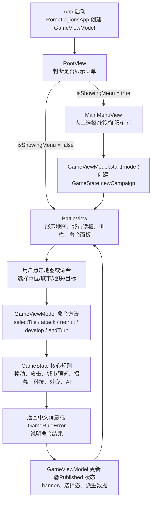
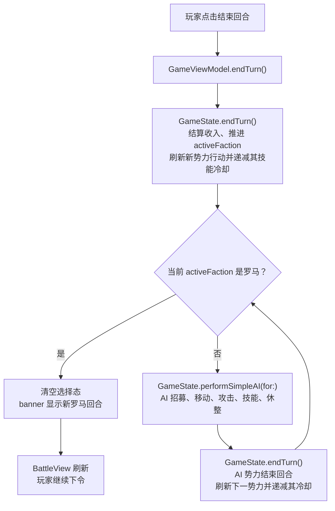
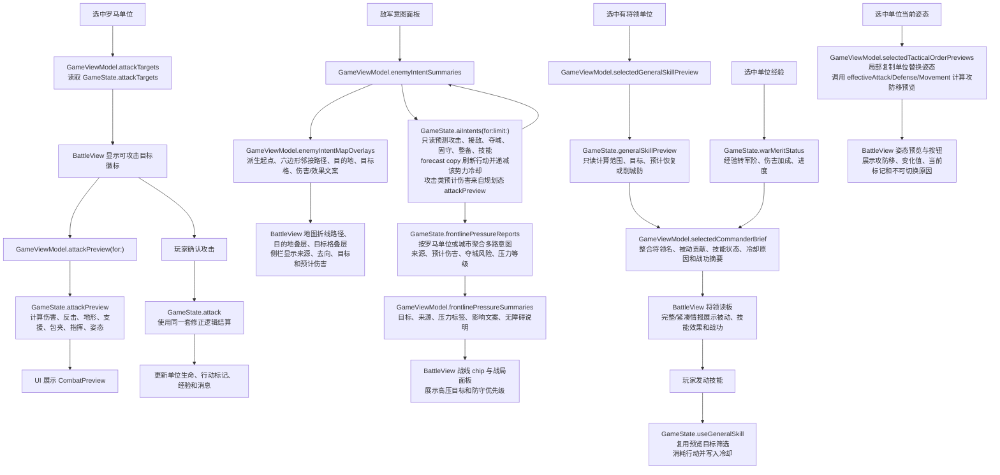
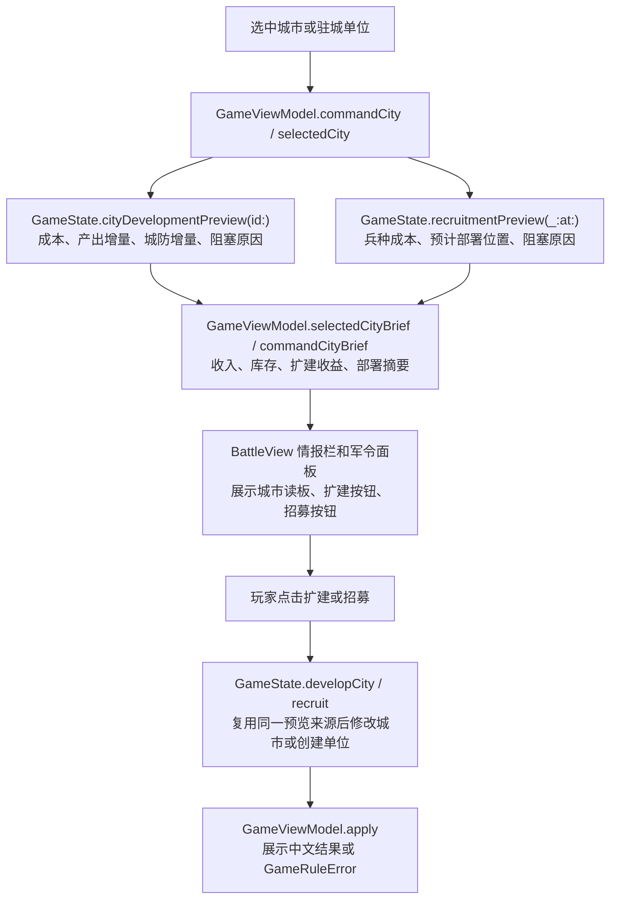
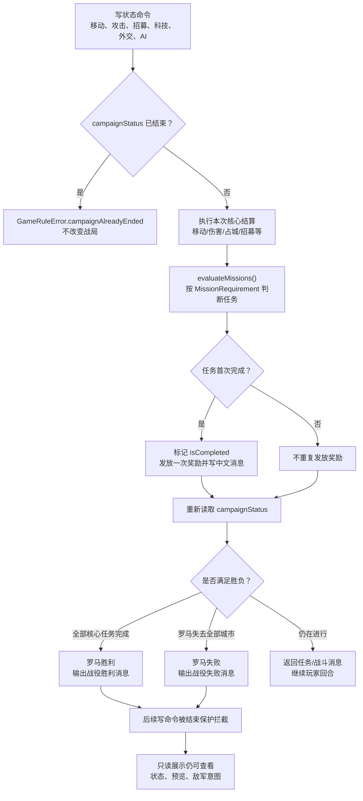
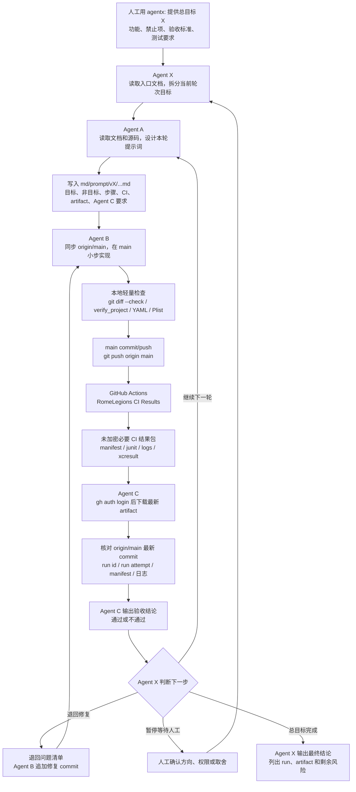
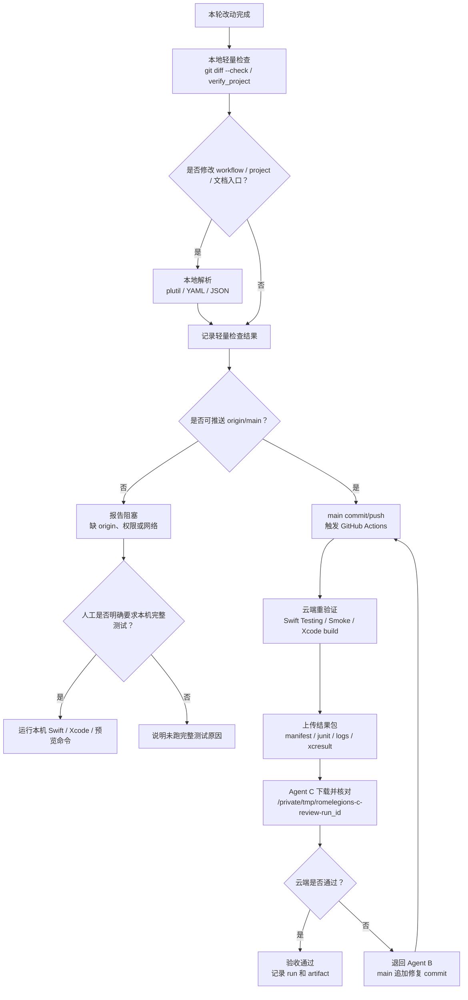

# 项目核心流程图

本文是 `md/flow/flow.md` 的可视化版本。每张图前都有中文读图说明，方便人工快速理解当前真实逻辑。

## 1. 核心数据流

读图说明：这张图展示从 App 启动到用户操作再到核心规则更新的主数据流。SwiftUI 不直接改规则状态，所有命令都先进入 `GameViewModel`，再调用 `GameState`。

## 2. 回合执行流

读图说明：这张图展示玩家回合结束后，系统如何依次执行非罗马势力 AI，直到重新回到罗马玩家回合。

## 3. 战斗与敌军意图流

读图说明：这张图展示战斗预览、实际攻击、敌军意图和战线压力之间的关系。关键铁律是预览与结算必须一致，敌军意图和战线压力只能读取和预测，地图路线只是 `AIIntent` 既有字段的可视化，不能改变状态或 AI 决策。

## 4. 城市经营与招募预览流

读图说明：这张图展示城市读板如何从核心只读预览派生到 UI。扩建和招募按钮展示的是预览状态，但真实执行仍回到 `GameState`，并复用同一成本、收益和部署来源。

## 5. 任务与胜负结算流

读图说明：这张图展示 v0.4 后任务 requirement、任务奖励、战役胜负和结束保护的关系。胜负只由 `GameState` 判断，SwiftUI 只读取结果和禁用入口。

## 6. 多 Agent 云端迭代流

读图说明：这张图展示人工、Agent X、Agent A、Agent B、GitHub Actions 和 Agent C 的职责边界。Agent X 只做主控调度和轮次判断，不替代 A/B/C；当前默认不是 PR 流，而是 `main` 直推、云端结果包、Agent C 下载复判；失败时在 `main` 上追加修复 commit。

## 7. 测试选择流

读图说明：这张图帮助 Agent B/C/X 判断默认验证路径。默认先跑本地轻量检查，再 push 到 `main` 触发云端重验证；只有人工明确要求时才把本机完整 Swift / Xcode 测试作为默认路径。

