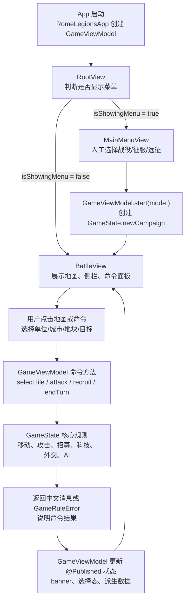
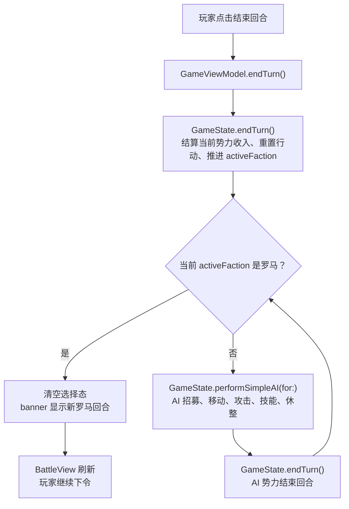
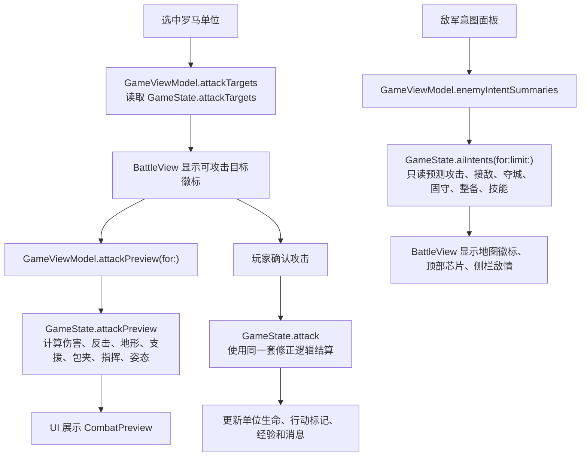
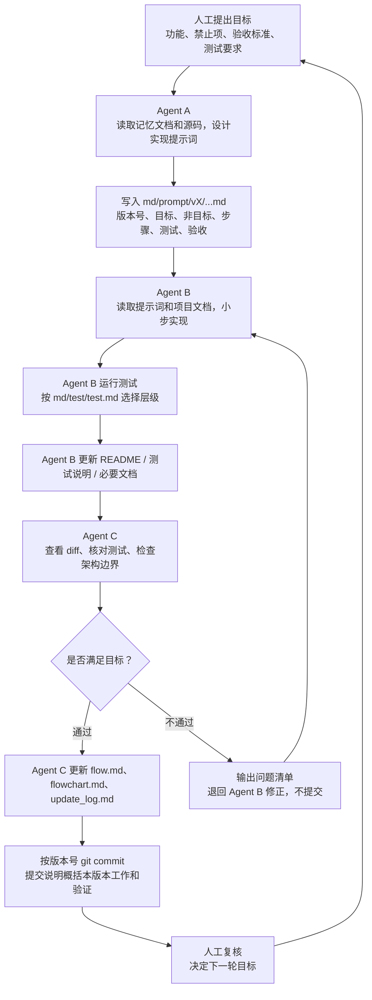
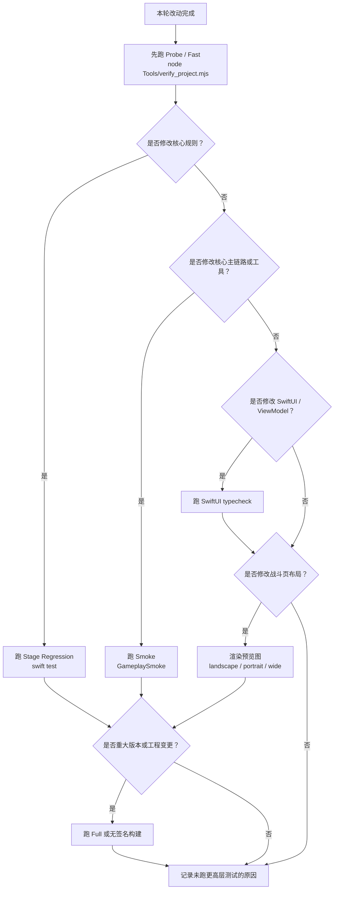

# 项目核心流程图

本文是 `md/flow/flow.md` 的可视化版本。每张图前都有中文读图说明，方便人工快速理解当前真实逻辑。

## 1. 核心数据流

读图说明：这张图展示从 App 启动到用户操作再到核心规则更新的主数据流。SwiftUI 不直接改规则状态，所有命令都先进入 `GameViewModel`，再调用 `GameState`。

## 2. 回合执行流

读图说明：这张图展示玩家回合结束后，系统如何依次执行非罗马势力 AI，直到重新回到罗马玩家回合。

## 3. 战斗与敌军意图流

读图说明：这张图展示战斗预览、实际攻击和敌军意图之间的关系。关键铁律是预览与结算必须一致，敌军意图只能读取和预测，不能改变状态。

## 4. 多 Agent 迭代流

读图说明：这张图展示人工、Agent A、Agent B、Agent C 的职责边界。Agent A 写提示词，Agent B 实现测试，Agent C 验收并更新核心流程文档；通过后按版本号自动提交，不通过就退回 Agent B 修正。

## 5. 测试选择流

读图说明：这张图帮助 Agent B/C 快速判断应该跑哪些测试。默认先跑最快的结构检查，再根据是否改核心、UI、工程或布局扩大验证范围。

