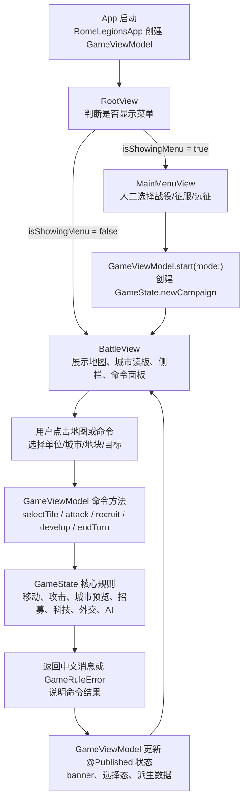
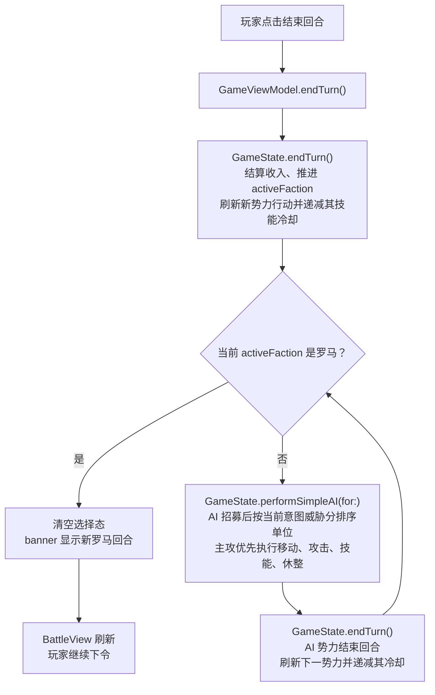
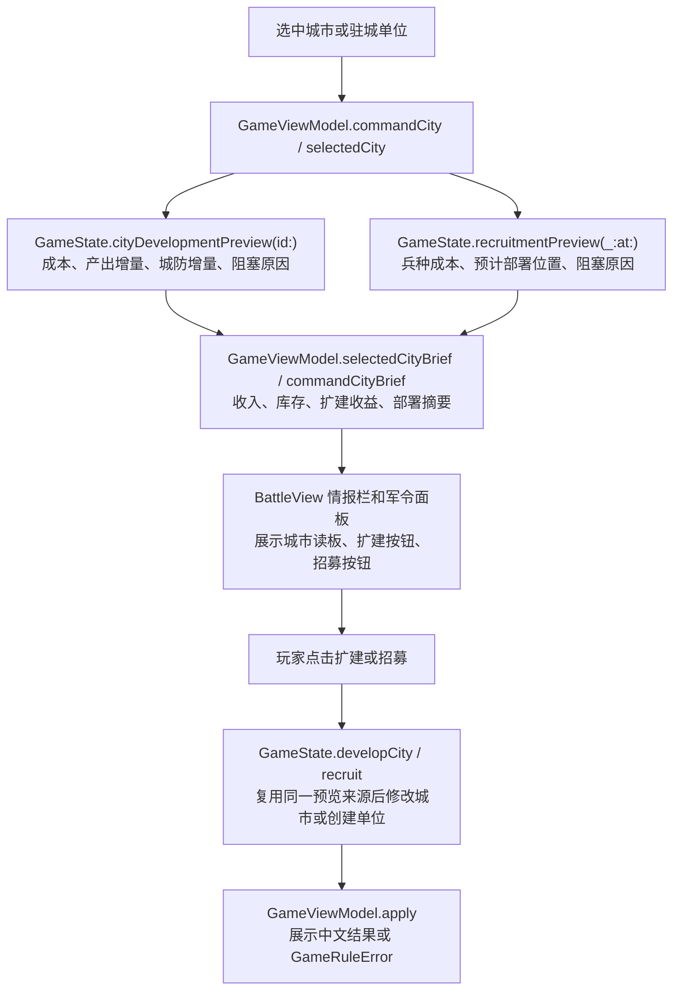
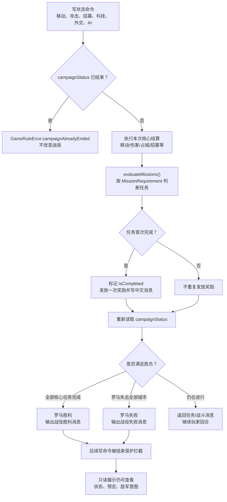
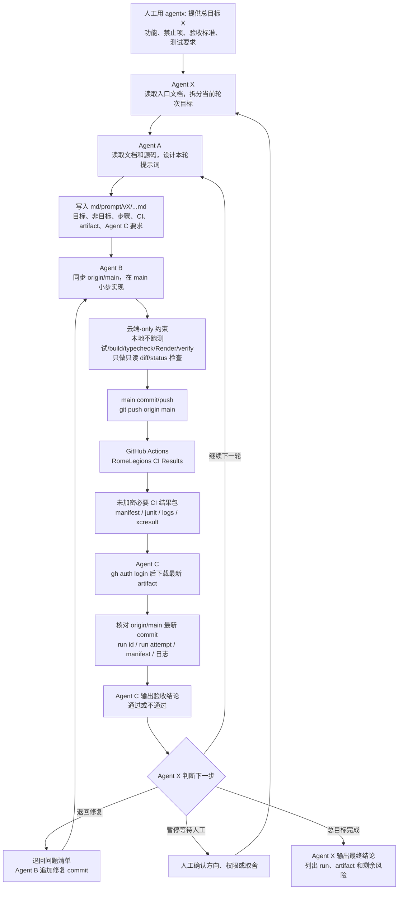
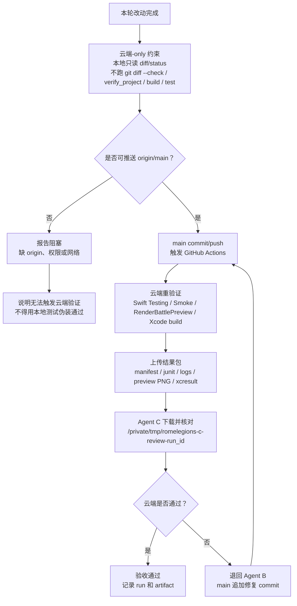

# 项目核心流程图

本文是 `md/flow/flow.md` 的可视化版本。每张图前都有中文读图说明，方便人工快速理解当前真实逻辑。

## 1. 核心数据流

读图说明：这张图展示从 App 启动到用户操作再到核心规则更新的主数据流。SwiftUI 不直接改规则状态，所有命令都先进入 `GameViewModel`，再调用 `GameState`。

## 2. 回合执行流

读图说明：这张图展示玩家回合结束后，系统如何依次执行非罗马势力 AI，直到重新回到罗马玩家回合。

## 3. 战斗、敌军意图、AI 作战计划、将领协同、机动落点、战术建议、战场焦点与地图热区流

读图说明：这张图展示战斗预览、实际攻击、敌军意图、AI 作战计划与时间线读板、敌方将领威胁、敌情反制建议及地图叠层/指令预览/命令链高亮/焦点链路、本方将领协同与步骤读板、机动落点、战线压力、玩家侧战术建议、战场焦点、战场目标链路、战场目标线地图叠层、阶段聚焦、阶段命令预览、阶段联动高亮、战场态势交汇链路、地图侦察视角 HUD、战役推进线 HUD、敌情交战闭环 HUD、选中军团处境命令入口读板、选中军团军令窗口读板、将令技能入口链路、将领指挥链读板、将领战机威胁桥接读板、将领技能目标与收益读板、地图控制和威胁热区之间的关系。关键铁律是预览与结算必须一致，敌军意图、AI 作战计划与时间线读板、敌方将领威胁、敌情反制建议、本方将领协同、将领协同步骤读板、机动落点、战线压力、战术建议、战场焦点、战场目标链路、战场态势交汇链路、地图侦察视角、战役推进线、敌情交战闭环、选中军团处境命令入口读板、选中军团军令窗口读板和地图热区只能读取和预测，地图路线、机动落点、反制落点/目标、战场目标线、目标线阶段聚焦/命令预览/联动高亮、战场态势交汇读板、地图侦察视角 HUD、战役推进线 HUD、敌情交战闭环 HUD、选中军团处境命令入口读板、选中军团军令窗口读板、将令技能入口链路、将领指挥链读板、将领战机威胁桥接读板、将领技能目标与收益读板、热区叠层、敌将卡、反制卡、反制指令预览、反制命令按钮高亮、反制焦点链路、将令卡、计划卡、计划时间线和焦点卡只是只读报告的可视化，不能改变状态、结算或 AI 决策。

```mermaid
flowchart TD
    A["选中罗马单位"] --> B["GameViewModel.attackTargets<br/>读取 GameState.attackTargets"]
    A --> BH["GameViewModel.reachablePositions<br/>读取选中单位真实可达格"]
    B --> C["BattleView 显示可攻击目标徽标"]
    B --> BL
    BH --> BL
    C --> D["GameViewModel.attackPreview(for:)"]
    D --> E["GameState.attackPreview<br/>计算伤害、反击、地形、支援、包夹、指挥、姿态"]
    E --> F["UI 展示 CombatPreview"]
    C --> G["玩家确认攻击"]
    G --> H["GameState.attack<br/>使用同一套修正逻辑结算"]
    H --> I["更新单位生命、行动标记、经验和消息"]

    J["敌军意图面板"] --> K["GameViewModel.enemyIntentSummaries"]
    K --> L["GameState.aiIntents(for:limit:)<br/>只读预测攻击、接敌、夺城、固守、整备、技能<br/>forecast copy 刷新行动并递减该势力冷却<br/>攻击类预计伤害来自规划态 attackPreview"]
    K --> M["GameViewModel.enemyIntentMapOverlays<br/>派生起点、六边形邻接路径、目的地、目标格、伤害/效果文案"]
    L --> K
    M --> W["BattleView 地图折线路径、目的地叠层、目标格叠层<br/>侧栏显示来源、去向、目标和预计伤害"]
    M --> BL["GameViewModel.activeMapOverlayLegendItems<br/>汇总敌路/目标、热区、控区、军议、机动、目标线、反制、可达、攻击、技能等当前可见叠层图例"]
    L --> LF["performSimpleAI 当前状态排序<br/>读取单体 AIIntent.threatScore<br/>高威胁主攻单位先行动"]
    LF --> LG["真实 AI 执行<br/>单位内部仍走原休整、技能、攻击、移动后攻击分支"]
    L --> AB["GameState.frontlinePressureReports<br/>按罗马单位或城市聚合多路意图<br/>来源、预计伤害、夺城风险、压力等级"]
    AB --> AC["GameViewModel.frontlinePressureSummaries<br/>目标、来源、压力标签、影响文案、无障碍说明"]
    AC --> AD["BattleView 战线 chip 与战局面板<br/>展示高压目标和防守优先级"]
    L --> AR["GameState.aiOperationalPlanReports<br/>聚合敌军意图、压力、热区和敌方将领技能机会<br/>输出集火、夺城、将领技能、推进、固守或整备计划"]
    AB --> AR
    AO --> AR
    AU["敌方 forecast 技能预览<br/>aiOperationalPlanReports 内部只读调用 generalSkillPreview<br/>不读取玩家选中单位"] --> AR
    AR --> AS["GameViewModel.aiOperationalPlanSummaries<br/>计划类型、协同角色、来源、目标、预计影响和无障碍文案"]
    AS --> AT["BattleView 计划 chip、敌情计划卡、战局计划行<br/>只展示核心报告，不改变 AI 决策"]
    AR --> BO["GameState.enemyCommanderThreatReports<br/>聚合敌方将领 trait、技能预览、AI 意图、计划、压力和热区<br/>敌方 forecast 下读取技能窗口"]
    L --> BO
    AB --> BO
    AO --> BO
    AU --> BO
    BO --> BP["GameViewModel.enemyCommanderThreatSummaries<br/>敌将等级、技能窗口、目标、影响、状态和无障碍文案"]
    BP --> BQ["BattleView 敌将 chip、敌情敌将卡、战局敌将行<br/>只展示核心报告，不重算威胁分或技能目标"]
    BO --> BR["GameState.countermeasureReports<br/>聚合敌将威胁、AI 计划、战线压力、热区<br/>复用本方战术、机动和将令报告生成反制建议"]
    AR --> BR
    AB --> BR
    AO --> BR
    AI --> BR
    AY --> BR
    AV --> BR
    BR --> BS["GameViewModel.countermeasureSummaries<br/>回应单位、命令、收益、风险和关联来源"]
    BS --> BT["BattleView 反制 chip、敌情反制卡、战局反制行<br/>只展示核心报告，不自动下令"]
    BS --> BU["GameViewModel.primaryCountermeasureMapOverlay<br/>派生回应位置、推荐落点、威胁目标、阶段标签和反制引导线"]
    BU --> BV["BattleView 地图反制线、1 回应/2 落点/3 目标叠层<br/>只展示空间关系，不改变命令或 AI"]
    BU --> BL
    BS --> BW["GameViewModel.countermeasureCommandPreviews<br/>推荐姿态、落点可达、目标窗口、命令链短标签、焦点链路和阻塞原因"]
    BW --> BX["focusCountermeasure 只改选择态和 banner<br/>BattleView 军令面板显示反制执行预览<br/>不移动、不攻击、不切姿态"]
    BW --> BY["BattleView 姿态按钮/攻击按钮反制高亮<br/>攻击按钮引用 3 目标 cue<br/>不覆盖 disabled，不改变 action"]

    AH["选中本方单位"] --> AI["GameState.tacticalRecommendation(unitID:)<br/>只读派生攻击、补线、推进、坚守或整备建议<br/>目标、目的地、路径、推荐姿态、风险和命令文案"]
    AI --> AJ["GameViewModel.selectedTacticalRecommendationSummary<br/>转成军议 chip、建议卡、路径线段和目标位置"]
    AJ --> AK["BattleView 地图本方建议路径/目标叠层<br/>选中单位情报展示建议理由和风险"]
    AJ --> BL
    AH --> AY["GameState.maneuverOptionReports(unitID:limit:)<br/>只读评估真实可达落点<br/>复用 projected 控图/热区/战线压力/占城目标/attackPreview"]
    AI --> AY
    AO --> AY
    AB --> AY
    AY --> AZ["GameViewModel.selectedManeuverOptionSummaries<br/>首要机动、落点 overlay、类型/风险/影响/无障碍文案"]
    AZ --> BA["BattleView 地图机动落点叠层、机动 chip、选中单位机动卡、战局机动行<br/>只展示报告，不自动移动或攻击"]
    AZ --> BL
    AH --> AV["GameState.commanderSynergyReport / commanderSynergyReports<br/>只读整合将领技能、编制、战术建议和攻击预览<br/>输出将领技能、合击、补线、推进或整备协同"]
    AI --> AV
    E --> AV
    P --> AV
    AF --> AV
    AV --> AW["GameViewModel.commanderSynergySummaries<br/>将令类型、协同步骤读板、支援/包夹/指挥、预计伤害或恢复、阻塞原因"]
    AW --> AX["BattleView 将令 chip、选中单位协同卡、战局协同行和步骤行<br/>只展示核心报告，不自动执行命令"]
    AI --> AL["GameState.battlefieldFocusReports<br/>综合压力、建议、编制和将领机会<br/>输出救线、打击、补线、推进、整编或将领焦点"]
    AB --> AL
    AF --> AL
    P --> AL
    AL --> AM["GameViewModel.battlefieldFocusSummaries<br/>标题、严重度、目标、单位、姿态和详情"]
    AM --> AN["BattleView 焦点 chip、战场焦点卡、战局焦点行<br/>只展示核心报告，不重新评分"]
    AM --> CO["GameViewModel.primaryBattleObjectiveChainSummary<br/>只读组合焦点、将令、机动和军议<br/>1 焦点 / 2 将令 / 3 机动 / 4 军议"]
    AW --> CO
    AZ --> CO
    AJ --> CO
    CO --> CP["BattleView 战场目标线、阶段定位按钮、地图阶段标记与各卡片 cue<br/>只解释和定位当前作战目标<br/>不移动、不攻击、不放技能、不切姿态"]
    CO --> CT["GameViewModel.battleObjectiveStageCommandPreviews<br/>阶段对应既有命令入口、推荐姿态、落点、目标、技能状态、下一步和阻塞原因"]
    CT --> CU["BattleView 目标线卡片、军令面板与命令入口联动高亮<br/>同源提示阶段按钮、地图徽标、姿态、攻击和技能入口<br/>不覆盖 action 或 disabled"]
    CO --> DA["GameViewModel.primaryBattlefieldConvergenceSummary<br/>聚合目标线、反制、反制指令预览、活动阶段、将令、机动、热区和控区<br/>输出主线/回应/空间/下一步/signal"]
    BS --> DA
    BW --> DA
    CT --> DA
    AW --> DA
    AZ --> DA
    AP --> DA
    DA --> DB["BattleView 战场态势交汇读板<br/>完整/紧凑战场面板与战局顶部展示<br/>不新增命令队列、不自动执行"]
    M --> EG["GameViewModel.primaryEnemyEngagementLoopReadout<br/>聚合敌军路线、战线压力、敌将、反制、反制指令、回应将领链和交汇读板"]
    AC --> EG
    BP --> EG
    BS --> EG
    BW --> EG
    CZ --> EG
    DA --> EG
    EG --> EH["BattleView 地图内敌情交战闭环 HUD<br/>一条紧凑提示展示敌路/压力/敌将/反制/回应/下一步<br/>不拦截点击、不自动执行"]
    EG --> ER["GameViewModel.mapReconPerspectiveHUDReadout<br/>按敌路/反制/目标线/热区视角组合既有 overlay、summary、preview 和交汇读板"]
    BU --> ER
    BW --> ER
    CO --> ER
    CT --> ER
    AP --> ER
    DA --> ER
    ER --> ES["BattleView 地图侦察视角 HUD<br/>按钮切换当前扫描视角，只改 ViewModel UI 视角和 banner<br/>不过滤叠层、不自动聚焦或执行命令"]
    MF["GameViewModel.primaryCampaignAdvanceReadout<br/>组合首要任务、战役进度、战线压力、目标线、阶段命令、侦察视角和态势交汇"] --> MG["BattleView 顶部推进 chip 与元老院推进线读板<br/>只解释战役目标如何落到地图下一步<br/>不自动聚焦、不自动执行"]
    ER --> MF
    CO --> MF
    CT --> MF
    AC --> MF
    DA --> MF
    AC --> DE["GameViewModel.selectedUnitSituationReadout<br/>聚合选中军团压力、热区、控区、编制、军议、机动、将令和命令入口<br/>输出压力/机会/入口/signal/commandEntries"]
    AP --> DE
    AF --> DE
    AJ --> DE
    AZ --> DE
    AW --> DE
    BW --> DE
    CT --> DE
    CV --> DE
    DE --> DF["BattleView 选中军团处境命令入口读板<br/>完整/紧凑情报面板展示一条入口 cue<br/>不新增评分、命令队列或自动执行"]
    DE --> EO["GameViewModel.selectedUnitOrderWindowReadout<br/>聚合处境、反制、目标线、将领战机、军议、机动、姿态、敌情和态势<br/>输出行动顺序窗口"]
    BW --> EO
    CT --> EO
    DZ --> EO
    CZ --> EO
    AJ --> EO
    AZ --> EO
    Z --> EO
    EG --> EO
    DA --> EO
    EO --> EP["BattleView 选中军团军令窗口读板<br/>完整/紧凑情报面板展示开局、姿态、入口和下一步<br/>不新增按钮、不自动执行"]
    CT --> CV["GameViewModel.selectedCommanderActionGuidance<br/>组合将领简报、技能预览、将令协同与 2 将令阶段 cue"]
    AW --> CV
    Q --> CV
    P --> CV
    CV --> CW["BattleView 将领状态行与技能按钮 detail<br/>展示将令技能入口链路<br/>不改变技能 action 或 disabled"]
    CV --> CZ["GameViewModel.selectedCommanderChainReadout<br/>聚合将领 brief、技能目标、战功、将令、目标线和处境入口<br/>输出被动/目标/战功/入口/signal"]
    AW --> CZ
    CT --> CZ
    DE --> CZ
    CZ --> DZ["GameViewModel.selectedCommanderOpportunityBridgeReadout<br/>聚合指挥链、技能目标、将令机会、敌将威胁、反制指令、目标线阶段和敌情闭环<br/>输出战机/敌将/入口/下一步"]
    CY --> DZ
    AW --> DZ
    BP --> DZ
    BS --> DZ
    BW --> DZ
    CT --> DZ
    EG --> DZ
    CO --> CQ["GameViewModel.primaryBattleObjectiveMapOverlay<br/>派生 1 焦点/2 将令/3 机动/4 军议位置和金色连线"]
    CQ --> CR["BattleView 地图目标线叠层<br/>只展示空间关系，不声明真实路径或自动命令"]
    CP --> CS["focusPrimaryBattleObjectiveStage<br/>只改 selectedPosition、可执行单位选择、focusedBattleObjectiveRole 和 banner<br/>不写 GameState"]
    CQ --> BL
    L --> AO["GameState.mapControlReports / threatHeatZoneReports<br/>按地形、单位、城市、外交、意图和压力派生控区与热区<br/>不写状态，不改变 AI 评分"]
    AB --> AO
    AO --> AP["GameViewModel.mapControlSummaries / threatHeatZoneSummaries<br/>控区、热区、来源、影响和 overlay positions"]
    AP --> AQ["BattleView 地图低透明热区叠层、热区 chip、战场卡、战局行<br/>不在 SwiftUI 重新算射程或路径"]
    AP --> BL
    BL --> BM["BattleView 地图底部主动图例<br/>图标、标题、说明和阵营色<br/>只解释叠层，不改变规则"]

    N["选中有将领单位"] --> O["GameViewModel.selectedGeneralSkillPreview"]
    O --> BL
    O --> P["GameState.generalSkillPreview<br/>只读计算范围、目标、预计恢复或削城防"]
    O --> CY["GameViewModel.selectedGeneralSkillTargetReadout<br/>目标数、收益、地图紫标数量和目标短列表"]
    P --> Q["GameViewModel.selectedCommanderBrief<br/>整合将领名、被动贡献、技能状态、冷却原因和战功摘要"]
    CY --> CZ
    Q --> CZ
    U --> CZ
    CZ --> X["BattleView 将领读板<br/>完整/紧凑情报展示被动、指挥链、战机桥接、技能效果、技能目标收益、将令技能入口和战功"]
    DZ --> X
    CY --> X
    Q --> X
    X --> R["玩家发动技能"]
    R --> S["GameState.useGeneralSkill<br/>复用预览目标筛选<br/>消耗行动并写入冷却"]

    T["选中单位经验"] --> U["GameState.warMeritStatus<br/>经验转军阶、伤害加成、进度"]
    U --> Q

    AE["选中单位或罗马军团列表"] --> AF["GameState.legionFormationReports / legionFormationReport<br/>只读派生职责、战备、友军支援、近敌、建议姿态和命令建议"]
    AF --> AG["GameViewModel.legionFormationSummaries<br/>顶部军团 chip、战局行、选中单位编制卡"]
    AG --> X
    AE --> BG["GameState.trainingPreview / generalAppointmentPreview<br/>只读派生成本、预计军阶/伤害/恢复、候选将领和阻塞原因"]
    U --> BG
    BG --> BH2["GameViewModel.selectedUnitDevelopmentDecisionSummary<br/>训练/任命成长读板和按钮 detail"]
    BH2 --> BI["BattleView 成长卡与训练/任命按钮<br/>展示成本、收益、状态和阻塞<br/>不重算资源、候选或军阶"]
    BI --> BJ["玩家训练或任命"]
    BJ --> BK["GameState.trainUnit / appointGeneral<br/>复用同一预览成本、收益和候选后写状态"]
    BG --> BL2["GameState.unitDevelopmentRecommendationReports<br/>只读汇总训练/任命推荐<br/>复用成长预览与军团编制"]
    AF --> BL2
    BL2 --> BM2["GameViewModel.unitDevelopmentRecommendationSummaries<br/>成长优先级、评分、理由、影响和状态"]
    BM2 --> BN2["BattleView 成长 chip 与战局成长行<br/>展示首要训练/任命建议<br/>不自动执行、不重算评分"]

    Y["选中单位当前姿态"] --> Z["GameViewModel.selectedTacticalOrderPreviews<br/>局部复制单位替换姿态<br/>调用 effectiveAttack/Defense/Movement 计算攻防移预览"]
    Z --> AA["BattleView 姿态预览与按钮<br/>展示攻防移、变化值、当前标记和不可切换原因"]
```

## 4. 城市经营与招募预览流

读图说明：这张图展示城市读板如何从核心只读预览派生到 UI。扩建和招募按钮展示的是预览状态，但真实执行仍回到 `GameState`，并复用同一成本、收益和部署来源。

## 5. 任务与胜负结算流

读图说明：这张图展示 v0.4 后任务 requirement、任务奖励、战役胜负和结束保护的关系。胜负只由 `GameState` 判断，SwiftUI 只读取结果和禁用入口。

## 6. 多 Agent 云端迭代流

读图说明：这张图展示人工、Agent X、Agent A、Agent B、GitHub Actions 和 Agent C 的职责边界。Agent X 只做主控调度和轮次判断，不替代 A/B/C；当前默认不是 PR 流，而是 `main` 直推、云端结果包、Agent C 下载复判；失败时在 `main` 上追加修复 commit。

## 7. 测试选择流

读图说明：这张图帮助 Agent B/C/X 判断当前验证路径。按人工最新要求，从 v0.15 起本地不运行测试、build、typecheck、RenderBattlePreview、`verify_project` 或 `git diff --check`；默认直接 push 到 `main` 触发云端重验证，并由 Agent C 下载结果包复判。

